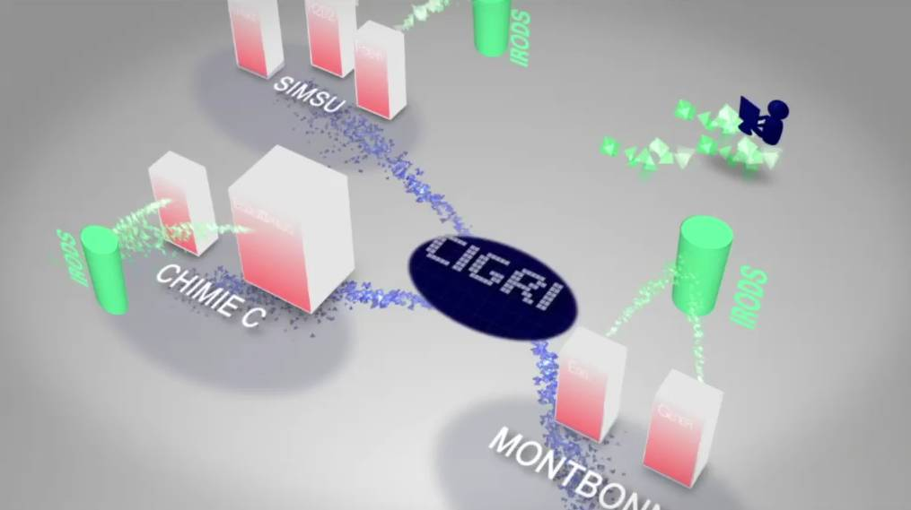
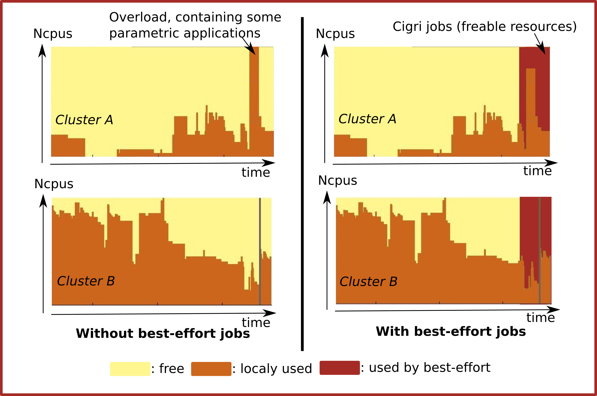
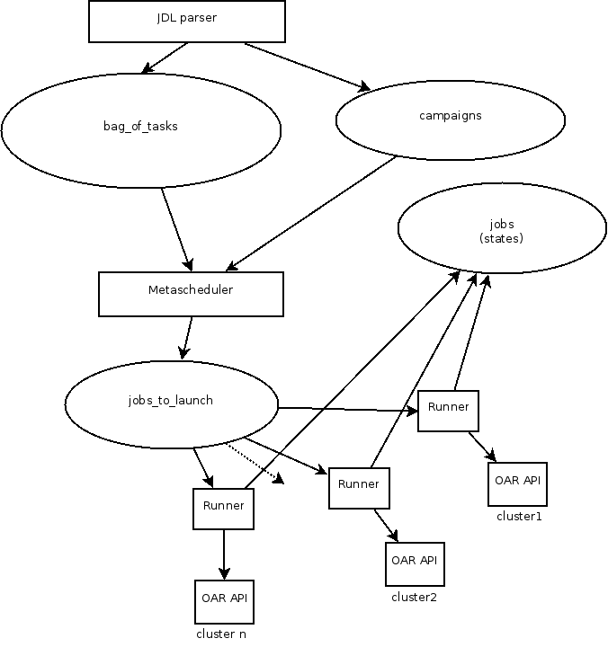
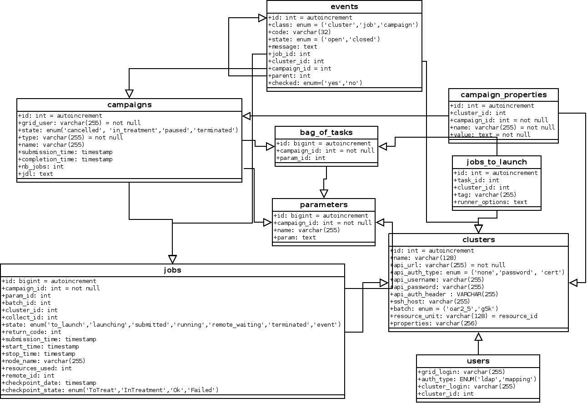
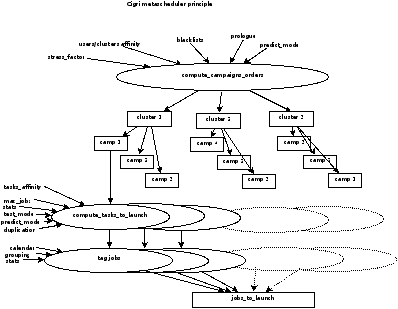

# cigri



 CiGri is a lightweight grid middle-ware designed to run on top of a set of OAR (http://oar.imag.fr) clusters to manage efficiently large sets of multi-parametric tasks (also called bag-of-tasks).

With a powerful events handling, it manages automatic re-submission that is useful for best-effort jobs. With OAR and CIGRI, it is easy to reach 100% of usage efficiency on an heterogeneous grid in a local HPC center.

CiGri v3 is written in Ruby by CIMENT, the MESCAL team (from the LIG laboratory) and INRIA. It is released as a free software under the GPL. 




## Main features

- Big job campaigns management (> 100000)
- OAR best-effort jobs management (automatic re-submission)
- Submission with a JSON description file and optional parameters file
- Users/Clusters affinity (prioritizing users on some clusters)
- Smart events management (events aggregation, stderr pull, blacklisting…)
- Admission rules
- Test mode
- Smart queue load management (adaptative runners)
- OAR array jobs submission (reduced submission overhead)
- Cluster stress detection
- RESTful API based communications with OAR
- RESTful API provided for client apps
- Full control of campaigns from CLI
- Per cluster campaign prologue/epilogue jobs
- Customizable users notifications (Mail or Jabber)
- Grid usage stats
- Per cluster/campaign limit of the number of jobs
- Heavy trace system (database)
- Tasks/clusters affinity

TODO:
- Scratches cleaner job
- Production Tasks/clusters affinity (currently beta)
- Production Smart temporal or dimensional grouping (currently beta)
- Web portal

## Quick example

Sample JDL file (Json):

```
{
  "name": "povray_demo",
  "resources": "core=1",
  "exec_file": "\$HOME/povray/start.bash",
  "exec_directory": "\$HOME/povray",
  "param_file": "/home/deamon/povray_params.txt",
  "test_mode": "true",
  "type": "best-effort",
  "prologue": [
    "set -e",
    "source /applis/ciment/v2/env.bash",
    "module load irods",
    "cd \\$HOME",
    "imkdir -p povray_results/\\$CIGRI_CAMPAIGN_ID",
    "iget -r -f povray"
  ],
  "clusters": {
    "gofree": {
      "walltime": "00:10:00",
      "max_jobs": 50
    },
    "fontaine": {
      "walltime": "00:10:00"
    },
    "froggy": {
      "project": "test",
      "walltime": "00:5:00"
    },
    "fostino": {
      "walltime": "00:10:00"
    }
  }
}
```

Submission:

```
gridsub -f file.jdl
```

Get status:

```
# Global status of the grid
> gridstat

Campaign id Name                User             Submission time     S  Progress
----------- ------------------- ---------------- ------------------- -- --------
20960       ABCD_H_VX-new       xbahuibo         2022-02-08 14-03-22 Re 0/6 (0%)
21039       abc_gipsyx_2018     boulabzi         2022-03-20 10-35-13 R  146295/377271 (38%)

# Status of a campaign
> gridstat -c 20960

Campaign: 20960
  Name: ABCD_H_VX-new
  User: xbahuibo
  Date: 2022-02-08 14-03-22
  State: in_treatment (events)
  Progress: 0/6 (0%)
  Stats: 
    average_jobs_duration: 
    stddev_jobs_duration: 
    jobs_throughput: ~ jobs/h
    remaining_time: ~ hours
    failures_rate: 97.9 %
    resubmit_rate: 97.8 %
  Clusters: 
    luke:
      active_jobs: 0
      queued_jobs: 4
      prologue_ok: true
      epilogue_ok: true
```

## Dev corner

Global picture:



Database scheme:



Metascheduler:


